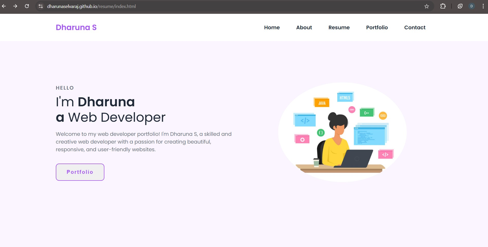
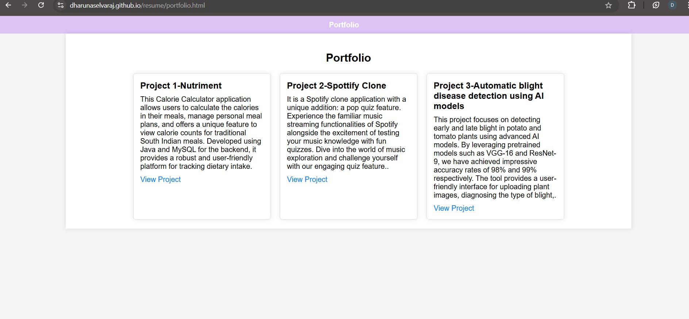

# Personal Portfolio

Welcome to my personal portfolio! This project showcases my skills, experiences, and projects, providing a platform to explore my work and learn more about my journey as a software developer.

## Table of Contents
- [Features](#features)
- [Screenshots](#screenshots)
- [Installation](#installation)
- [Usage](#usage)
- [Technologies Used](#technologies-used)
- [Contributing](#contributing)
- [License](#license)
- [Acknowledgements](#acknowledgements)

## Features
- **Project Showcases**: View and explore the projects I've worked on with detailed descriptions.
- **Responsive Design**: The portfolio is built to be fully responsive, providing a seamless experience across devices.
- **About Me Section**: Learn more about my background, skills, and career path.
- **Contact Information**: Reach out to me directly through my contact links.

## Screenshots




## Installation

### Prerequisites
- A web browser (Chrome, Firefox, Safari, etc.)

### Steps
1. **Clone the repository**:
    ```sh
    git clone https://github.com/yourusername/personal-portfolio.git
    ```
2. **Navigate to the project directory**:
    ```sh
    cd personal-portfolio
    ```
3. **Open the `index.html` file** in your web browser to view the site.

## Usage
1. **Launch the app**:
    Open the `index.html` file in your preferred browser.
2. **Explore the Portfolio**:
    Browse through my projects, read about my skills and experiences, and check out my contact details.

## Technologies Used
- **Frontend**:
  - HTML
  - CSS (for styling and responsiveness)

## Contributing
Contributions are welcome! Please follow these steps to contribute:
1. **Fork the repository**.
2. **Create a new branch**:
    ```sh
    git checkout -b feature/your-feature-name
    ```
3. **Commit your changes**:
    ```sh
    git commit -m 'Add some feature'
    ```
4. **Push to the branch**:
    ```sh
    git push origin feature/your-feature-name
    ```
5. **Open a Pull Request**.

## License
This project is licensed under the MIT License - see the [LICENSE](LICENSE) file for details.

## Acknowledgements
- Thanks to the open-source community for providing resources and frameworks to help build this portfolio.
- Special thanks to the contributors who have inspired my work and personal growth in software development.

